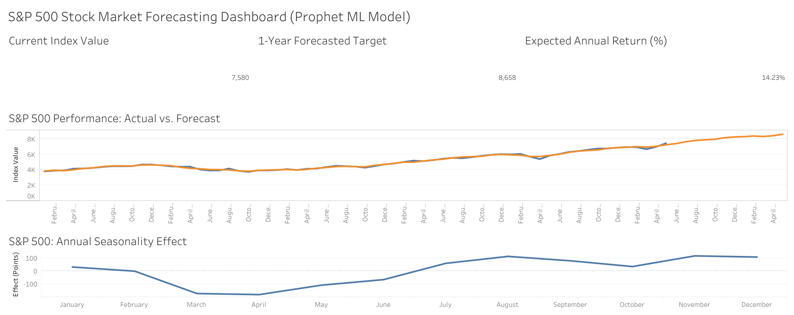

# S&P 500 Forecasting & Seasonality Analytics Dashboard

An end-to-end data product that predicts S&P 500 index trends and extracts hidden intra-year market seasonality using Machine Learning (Facebook Prophet) and visualizes insights in an interactive Tableau Dashboard.

🎯 **Live Dashboard:** [Link to your Tableau Public Profile]

---

## 📈 Dashboard Preview
 
*(Tip: Replace this image placeholder with a screenshot of your beautiful final Tableau dashboard once uploaded to GitHub!)*

---

## 🚀 Business Value & Insights
Financial analysts and risk managers often struggle to separate long-term macroeconomic market trends from repetitive calendar anomalies. This project solves that by decomposing the S&P 500 index behavior:
* **Expected Annual Return Metric:** Dynamically calculates the 1-year forecasted return based on the latest historical market close versus the ML target.
* **Annual Seasonality Wave:** Isolates predictable calendar patterns. The model successfully identified the historical **"September Effect"** (autumn market dip) and the subsequent **"Santa Claus Rally"** (sharp surge in November-December).

---

## 🛠️ Tech Stack & Architecture

* **Data Ingestion:** `yfinance` API (automated extraction of historical market data).
* **Data Processing:** `Pandas` & `NumPy` for data cleaning, index flattening, and type handling.
* **Predictive Modeling:** `Facebook Prophet` (Additive Time-Series Forecasting model) with activated yearly seasonality and optimized trading-day constraints (`weekly_seasonality=False`).
* **BI & Analytics:** `Tableau Public` utilizing advanced **LOD Expressions ({FIXED})** and Window Functions to handle data aggregation across multi-row forecast structures.

---

## 📊 How the Model Works (Mathematical Approach)
The Prophet model decomposes the time series into three main components:
$$y(t) = g(t) + s(t) + h(t) + \epsilon_t$$

Where:
* $g(t)$ represents the non-periodic **Trend** (long-term growth).
* $s(t)$ represents **Seasonality** (periodic changes like the yearly wave).
* $h(t)$ represents holiday effects (not used here to avoid overfitting).

By isolating $s(t)$, we can visualize pure asset seasonality regardless of whether the market is currently in a global bull or bear phase.

---

## 📈 Dashboard Preview


## 💻 How to Run the Script Locally

1. Clone the repository:
   ```bash
   git clone https://github.com/bodnar4yk/sp500-forecasting-dashboard.git
   ```
2. Install dependencies:
   ```
   pip install -r requirements.txt
   ```
4. Run the ETL pipeline to generate the Tableau dataset:
   ```
   python scripts/forecast_model.py
   ```
